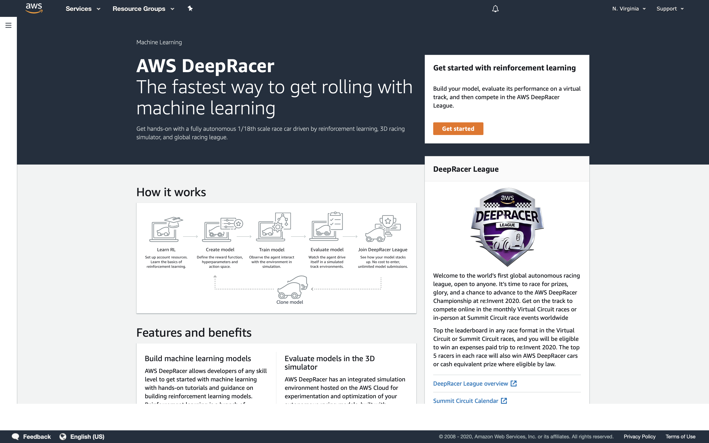
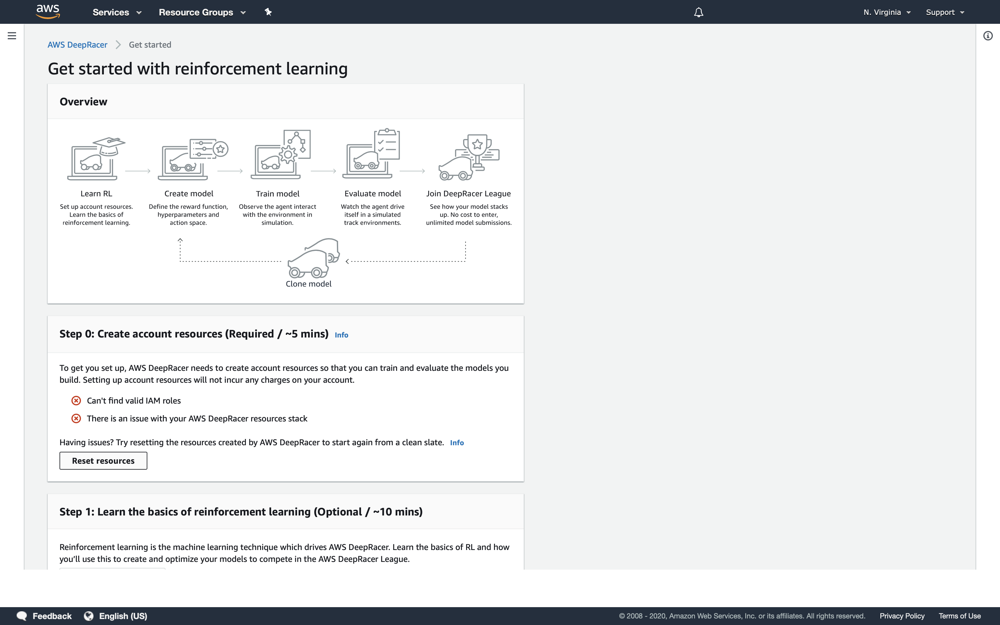
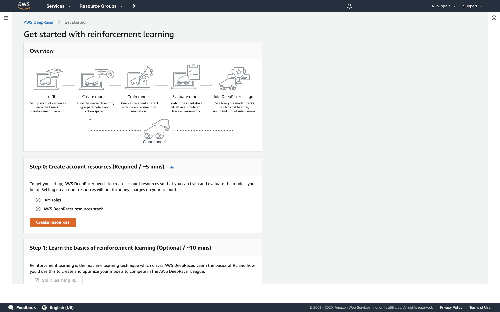
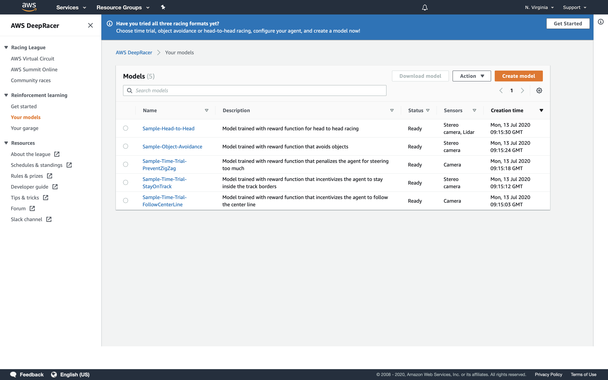
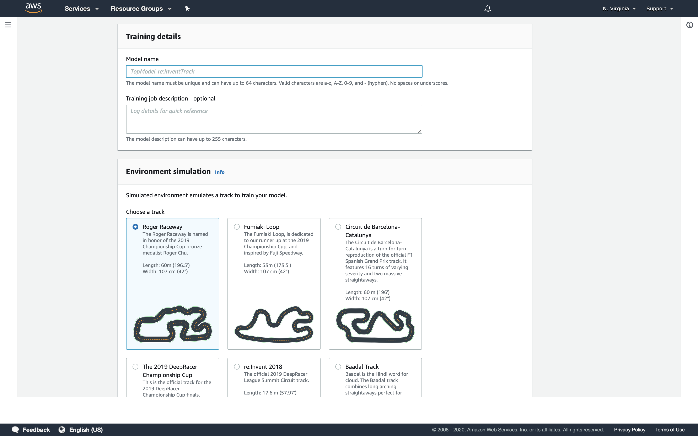
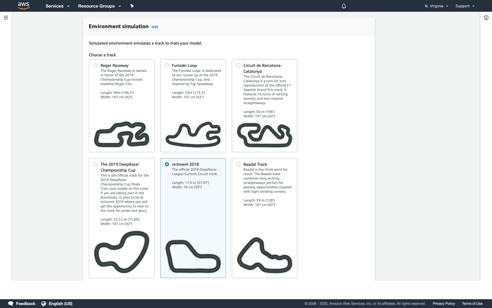
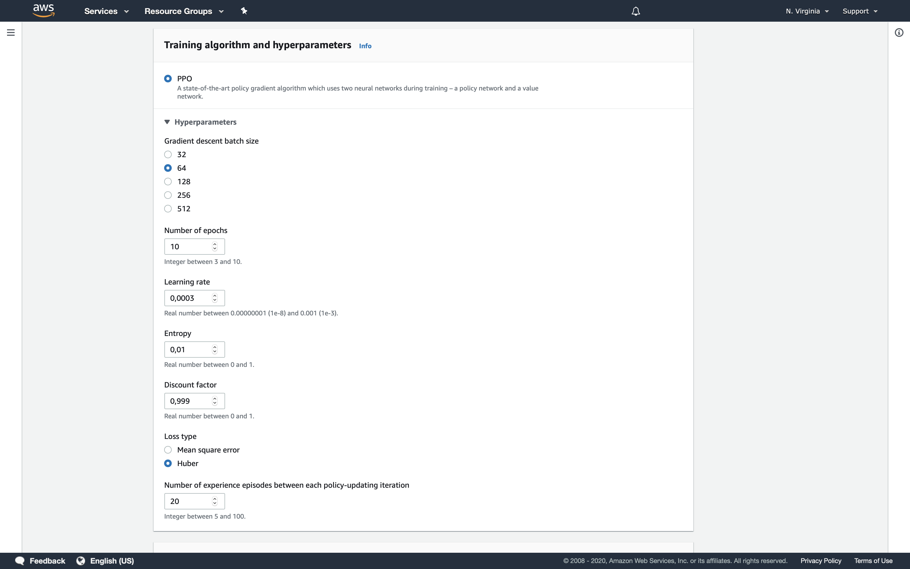
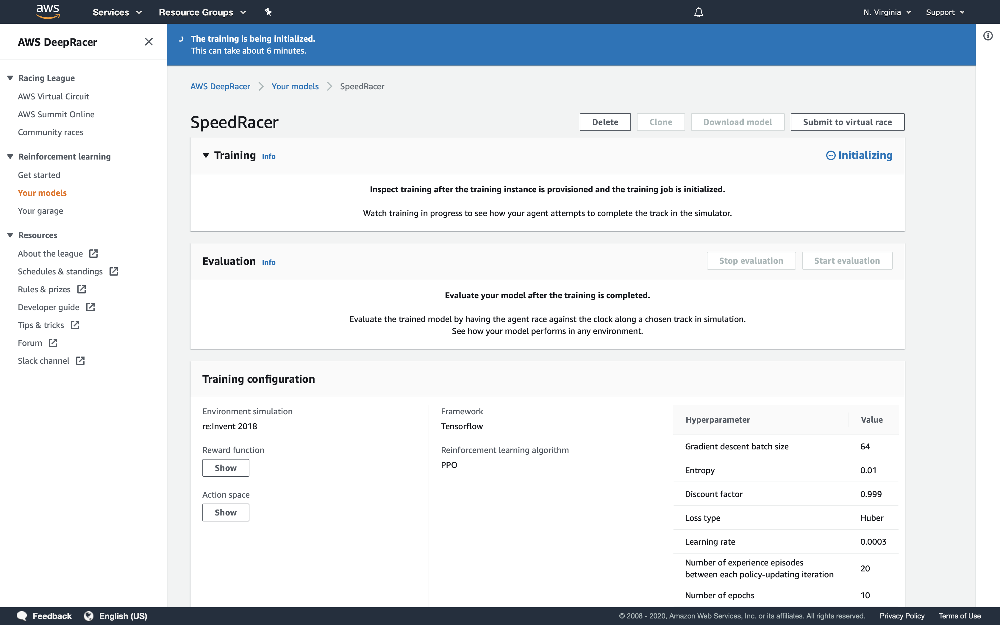
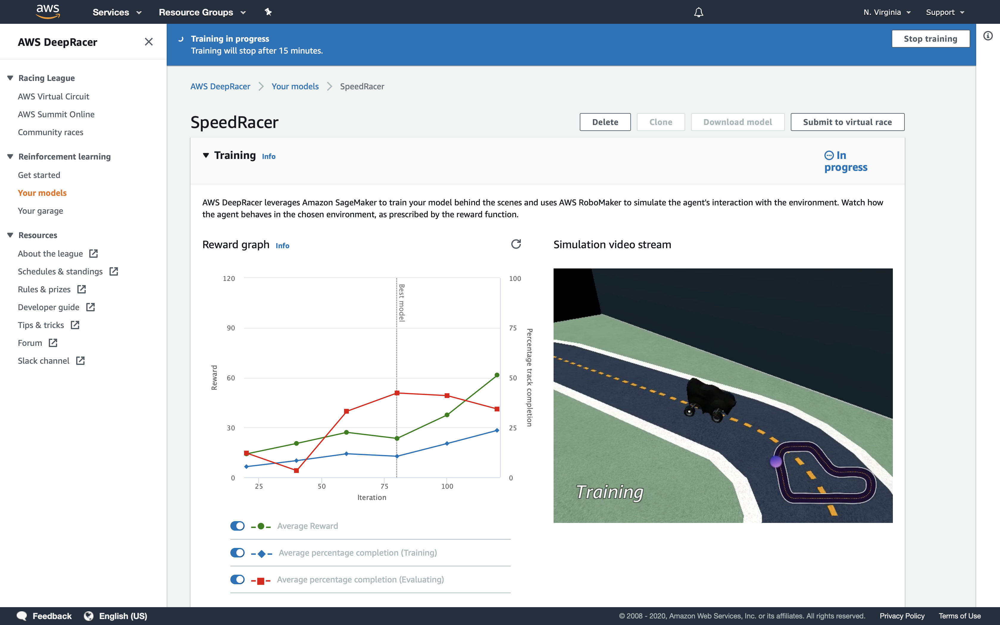

# Lab 1: Reward Function Constructors Championship!


#### Time breakdown

- Presenter provides competition and covers competition                   :  2 minutes
- Teams read lab content                                                  : 13 minutes
- Teams discuss and implement your reward function and start training     : 15 minutes
- Total                                                                   : 30 minutes 

## Overview
The goal of lab 1 is to get you familiar with the reward functions used to create RL models for AWS DeepRacer. To this end we have created an informal competition called the Reward Function Constructors Championship, where your team will compete to win bragging rights. The competition will also give you an overview of the AWS DeepRacer simulator found in the AWS Console.


## Reward Function Championship Instructions
Form a team with the other attendees at your table. Your team needs to engineer a reward function that will power your car, and the first team to reach the middle of the hairpin (the next turn on the track) with screenshot proof wins. The following image shows you where the finish line is. Note the finish line won't be on the track, so if you get halfway through the hairpin that is it, take a screenshot and shout out! Since it takes 6 minutes to spin up the containers, please train your model for at least 15 minutes.


Please read through the following sections and when you are finished feel free to start discussing in your team which reward function you need to create to reach the objective. You will have 13 minutes to read the content, and once done 15 minutes to debate and implement your reward function and kickoff training. Feel free to start discussing when you are done reading. Before you start training, nominate just one person to start training. We will continue with the workshop after the 30 minutes and this person will have to monitor the progress of training during the workshop. Everyone will get to implement their own reward function during lab 2.

Tip: As you read through the next sections carefully consider what behavior do you want to incentivize to ensure your car stays on track and makes the turn. You will have to write your reward function using Python3, but we provide three good examples to look at.

Let's get going!


## Step 1: AWS Console
Logon to the AWS Console using the account details provided to you.
Navigate to AWS DeepRacer, https://console.aws.amazon.com/deepracer/home?region=us-east-1
From the AWS DeepRacer landing page, click on the "Get started" button.




## Step 2: Initialize AWS DeepRacer

From the Get started page, you may need to initialize AWS DeepRacer. If you see an error that says "Can't find valid IAM roles", click on the button "Reset resources". 



 
After about 5 minutes, the page will refresh and you will see a button to "Create resources". Click on this button, and after a few minutes your AWS account will be ready to create and train models.




## Step 3: Model List Page

After AWS DeepRacer resources have been created in your AWS account, you should then expand the panel on the left of the screen, and under the "Reinforcement Learning" option, click on "Your models".
 
This page lists sample models and all models you have created. You will see each model's current status.

To create and train your own model, click on the **Create model** button




## Step 4: Create model
This page gives you the ability to create an RL model for AWS DeepRacer and start training. There are a few sections on the page, so let's look at each in detail.

#### Model details
Here you have the ability to name your model, provide a model description, and select the track to train on.

First, enter a model name and description, then scroll to the next section





#### Environment simulation

Here you will select the track on which your RL model will train. This track will be simulated by AWS RoboMaker throughout the training process, and you will be able to monitor training progress. We will cover that in a few steps.

 **Make certain to choose the re:Invent 2018 track and scroll to the next section..** After selecting the track, click on the "Next" button.



#### Race Type

For this race we are using the "Time trial", so you can click on the "Next" button.


#### Reward function
In RL, the reward function plays a **critical** role in training an RL model. The reward function directly impacts the behaviors that your model will learn, by determining which actions (from each specific state) lead to good outcomes and which actions lead to outcomes that should best be avoided. The reward function contains the “logic” to determine if an action was good or bad, and quantify it. For example, if your goal is for the car to finish a lap around a racetrack, rewarding the car for staying on the track, as opposed to going off the track, is a good starting point. An example of the logic used in a basic reward function that incentivizes the car for staying closer to the middle of the track can be seen in the Basic Reward function section.

There is a default reward function that can be modified, and by clicking on the "Reward function examples" button, you can see other reward functions to use or modify.


The reward function in the code editor contains the following logic.
```
def reward_function(params):
    '''
    Example of rewarding the agent to follow center line
    '''
    
    # Read input parameters
    track_width = params['track_width']
    distance_from_center = params['distance_from_center']
    
    # Calculate 3 markers that are at varying distances away from the center line
    marker_1 = 0.1 * track_width
    marker_2 = 0.25 * track_width
    marker_3 = 0.5 * track_width
    
    # Give higher reward if the car is closer to center line and vice versa
    if distance_from_center <= marker_1:
        reward = 1.0
    elif distance_from_center <= marker_2:
        reward = 0.5
    elif distance_from_center <= marker_3:
        reward = 0.1
    else:
        reward = 1e-3  # likely crashed/ close to off track
    
    return float(reward)
        
```
Here we first create three bands around the track, using the three markers, and then proceed to reward the car more for driving in the narrow band as opposed to the medium or the wide band. Also note the differences in the size of the reward. We provide a reward of 1 for staying in the narrow band, 0.5 for staying in the medium band, and 0.1 for staying in the wide band. If we decrease the reward for the narrow band, or increase the reward for the medium band, we are essentially incentivizing the car to be use a larger portion of the track surface. This could come in handy, especially when there are sharp corners.

The following reward heatmaps show the intensity of rewards received and how this is spread about the center line for a narrow band vs. a wide band.


Here is a list of variables that you can use to build the logic for your reward function. Note that the reward function has to be written using Python syntax, and we've added a **Validate** button to help you check that your code is good before training begins. 


#### Algorithm settings
This section controls the hyperparameters for your RL optimization algorithm. In the interest of
time, for the first lab we can skip this section, our default values should suffice for the lab.



#### Stop conditions
This is the last section before you start training. Here you can specify the maximum time your model will train for. Ideally you should put a number in this condition. You can always stop training early. Furthermore, if your mode stopped as a result of the condition, you can go to the model list screen, and clone your model to restart training using new parameters.


## Step 5: Reward Function Constructors' Championship
Once you reach this section please discuss in your team the reward function you need to implement to reach the goal. You will have 15 minutes to create it, implement it, and launch. Before you start training, nominate just one person to start training. We will continue with the workshop after the 30 minutes expired and this person will have to monitor the progress of training during the workshop. Everyone will get to implement their own reward function during lab 2. The sooner you start training your model the sooner your car will reach the middle of the hairpin.


## Step 6: Start Training

After you define your function, algorithm settings, training time, and click on "Create model".

Your model will then be initialized and trained. It takes a few minutes for training to start.



## Step 7: Monitor Progress

Once training starts, you can monitor the training and evaluation progress and watch a live simulation video.




[Go back to Workshop](https://github.com/aws-samples/aws-deepracer-workshops/blob/master/README.md)

--- 

## Additional Reading Not Required For Lab Purposes

#### Reward Function Comparison

Here's an example of a good reward function, observe how it has consistent high rewards over a long
period of time
 


Here's an example of a bad reward function, observe how its spikey and has low rewards


#### Algorithm settings
This section controls the hyperparameters for your RL optimization algorithm. Please expand it. These hyperparameters have been optimized by our scientists, through lots of testing. That said you are more than welcome to change them. 

Training happens through an iterative process of simulation to gather experience, followed by training on the experience to update your model, followed by simulation using the new model to get new experience, followed by training on the new experience to update your model and so forth. Initially your model does not have any knowledge of which actions will lead to good outcomes. It will choose actions at random as it explores the environment. Over time it will learn which actions are better and start to exploit these. How quickly it exploits or how long it explores is a trade-off that you have to make.


